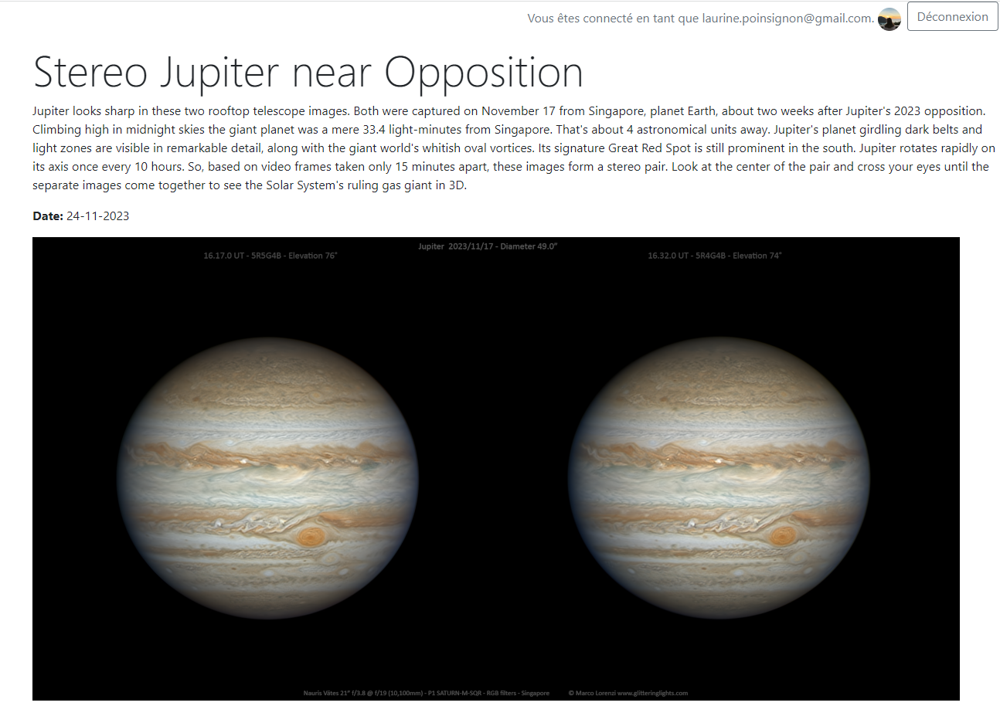

# Documentation

## Technologies utilisées

Les versions symfony et php ont été augmentées pour pouvoir utiliser les dernières fonctionnalités et versions.
* Symfony 6.3
* PHP 8.2

L'API de la Nasa est récupérée à l'aide de Http Client de Symfony.

Les librairies suivantes ont été utilisées pour gérer l'authentification Google :    
"knpuniversity/oauth2-client-bundle"  
"league/oauth2-client"
"league/oauth2-google"     

Un fichier de traduction a été mis en place avec symfony/translation.

## Initialisation du projet

### Installation des dépendances

    composer install

### Copier le .env en .env.local

    cp .env .env.local

Remplacer les données suivantes :  

DATABASE_URL     
NASA_API_KEY (clé d'api reçu par mail en s'inscrivant au site de la nasa)

L'application n'est pas validée par Google, pour tester la connexion Google, il vous faudra ajouter votre Google Id et votre Google Secret.    
GOOGLE_CLIENT_ID     
GOOGLE_CLIENT_SECRET    

https://support.google.com/workspacemigrate/answer/9222992?hl=fr    

Ajouter dans "URI de redirection autorisés" :    
http://localhost/google-connect     
http://localhost/connect/google/check     

### Créer la base de données

    php bin/console doctrine:database:create

### Ajout de la structure de la base de données

    php bin/console d:s:u --force

## Quel est le fonctionnement du projet ? 

Ce projet à pour but d'afficher la photo du jour récupérée depuis l'API de la NASA.

## Comment fonctionne le projet ?

Chaque jour, la commande suivante est lancée manuellement :

    php bin/console nasa:import-daily-photo

Cette commande récupère la photo du jour depuis l'API de la NASA ainsi que celle de la veille, si elles n'existent pas déjà et les enregistre en base de données.    
Si la photo du jour est une vidéo, la photo de la veille est affichée.

## Image du projet 

